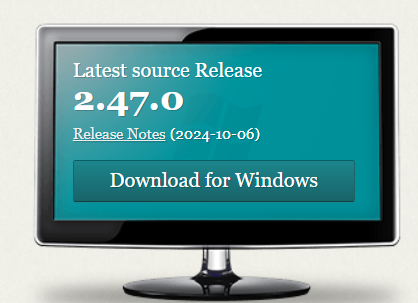
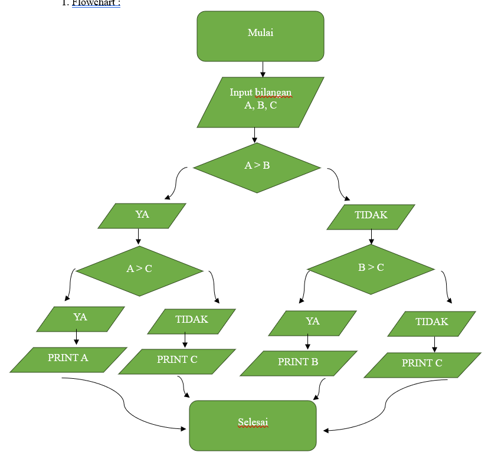
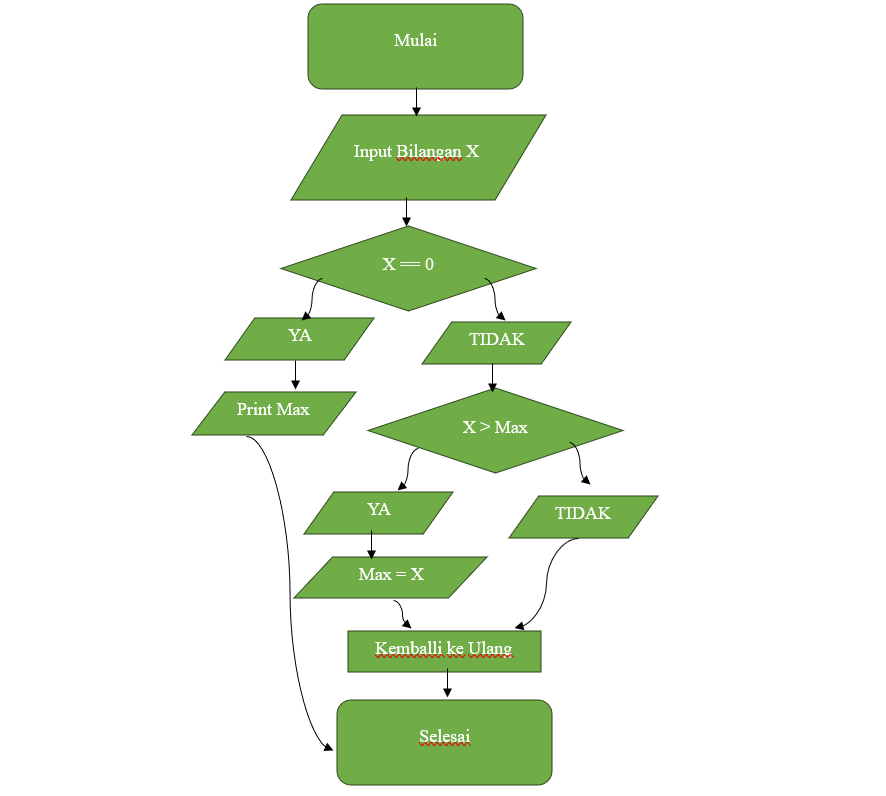

# Laporan-Praktikum
 Tugas Pertemuan ke 5

  Nabil Putra Alamsyah
  TI 24 A3
  312410376

## STEP 1 : Langkah Awal
    Menginstal Git pada perangkat anda
   

   -Membuat akun Github untuk menyimpan repository secara online

## STEP 2 : Membuat Repository
   -Login ke aku Github
   ](Gambar/gmbr2.png)
   -Klik tombol New Repository atau Create Repository
   
   -Beri nama Repository
   -Aktifkan opsi Add a README file dan klik Create Repository.
   ](Gambar/gmbr4.png)

## STEP 3 : Clone Repository ke Local (Komputer)
   -Buka terminal atau Command Prompt pada komputer
   -Jalankan perintah untuk meng-clone repository ke lokal
](Gambar/gmbr5.png)

## STEP 4 : Membuat dan Mengedit File README.md
   -Buka file README.md lalu edit sesuai perintah yang harus dilakukan
   -Menambah file baru
   ](Gambar/gmbr6.png)
   
## STEP 5 : Tambah dan Commit Perubahan
   -Tambahkan file ke staging area
   -Commit perubahan dengan pesan yang jelas
   -Kirim perubahan dari lokal ke GitHub dengan

   ## Bilangan Terbesar
   
   flowcart :
   

   contoh jalannya program :
   Masukkan 3 bilangan:

Masukkan bilangan pertama: 15
Masukkan bilangan kedua: 10
Masukkan bilangan ketiga: 8
Bilangan terbesar adalah: 15

Penjelasan Contoh:

Pengguna memasukkan 15, 10, dan 8 sebagai input.
Program membandingkan ketiga bilangan:
Apakah 15 >= 10 dan 15 >= 8? Ya, jadi 15 adalah bilangan terbesar.
Program menampilkan "Bilangan terbesar adalah: 15".

Penjelasan Logika Program:
if-elif-else digunakan untuk memeriksa mana dari ketiga bilangan yang paling besar.
float() digunakan agar program bisa menerima input bilangan desimal (bukan hanya bilangan bulat).
Program ini akan selalu menampilkan bilangan terbesar di antara tiga bilangan yang diberikan.

## Bilangan N

    flowchart :
    

    contoh jalannya program :

    Masukkan bilangan satu per satu.
Masukkan 0 untuk berhenti.
Masukkan bilangan: 5
Masukkan bilangan: 12
Masukkan bilangan: 8
Masukkan bilangan: 0
Bilangan terbesar adalah: 12

Penjelasan:

Pengguna memasukkan bilangan 5, 12, dan 8.
Saat 0 dimasukkan, program berhenti meminta input.
Program membandingkan semua bilangan yang diinput:
5 → max_value = 5
12 → max_value diperbarui menjadi 12
8 → Tidak mengubah max_value karena lebih kecil dari 12.
Program menampilkan "Bilangan terbesar adalah: 12".
